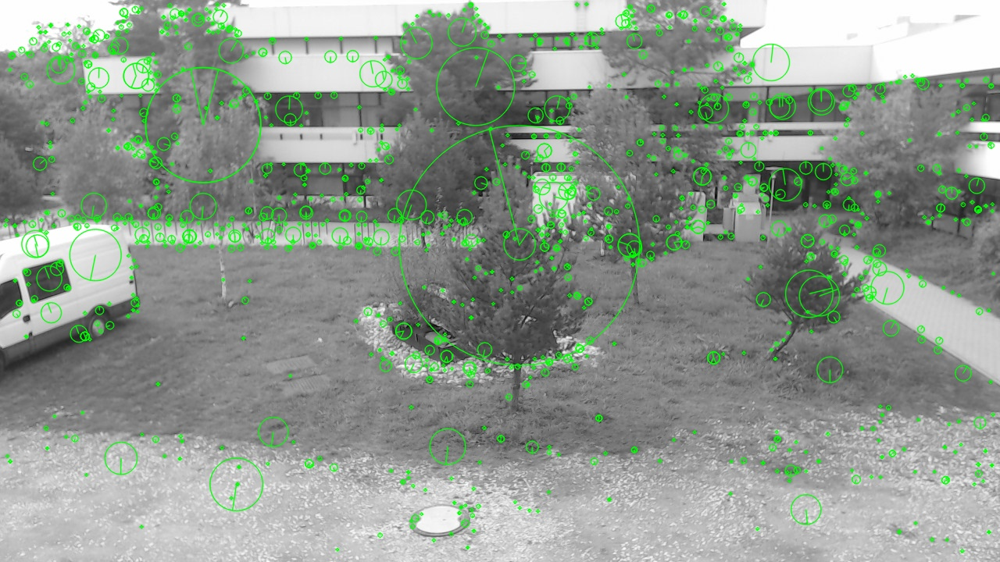
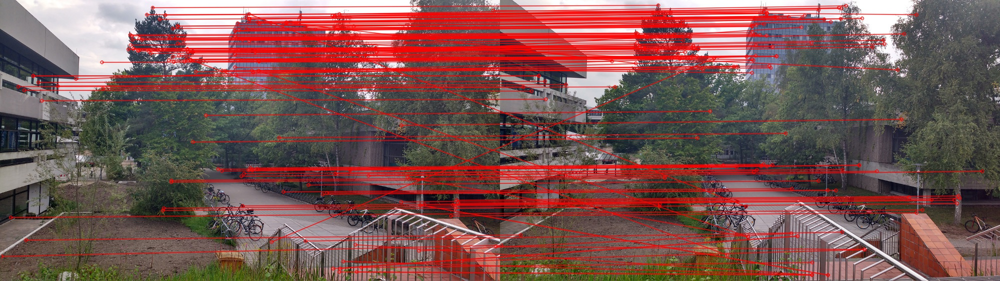

# Open CUDA Sift (OCS)

OCS is an open source GPU implemenation of SIFT feature detection and matching. The CUDA code is a direct port of [OpenCV's SIFT implementation](https://github.com/opencv/opencv_contrib/blob/master/modules/xfeatures2d/src/sift.cpp).

 
 

## Differences to OpenCV

 * Added an option to disable subpixel interpolation
 * Added an option to limit the maximum sample radius used in orientation assignment and descriptor computation
 * Output descriptor element range is [-1,1] instead of [-128,127]
 * Removed the "char rounding" at the end of descriptor computation
 * Added an option to limit the maximum number of octave layers
 * Added an option to upscale the image before feature detection
 * Use a fixed gaussian blur kernel size of 9x9

## Timings - Feature Detection (todo)

The following SIFT settings were used for the tests:

* doubleScale = false
* octaveLayers = 3
* contrastThresold = 0.04
* edgeThreshold = 10
* sigma = 1.6
* maxDescriptorRadius = 16

| Image Size  |      640x480      | 1280x720 | 1920x1080 | 3000x1688 | 4096x2304 | 
| --- | --- | --- | --- |--- |--- |
| #Features | 990 | 1408 | 1700 | 3382 |6184 |
| GTX 1080 | 10.01 | 10.01 | 10.01 | 10.01 |10.01 |
| GTX 970 | 10.01 | 10.01 | 10.01 | 10.01 |10.01 |
| GTX 760M | 9.10 | 17.2 | 29.4 | 60.2 | 105.6 |

## Timings - Matching (todo)

Time in (ms) for the knn search with k=4.

| Match Size   |      990x990      | 1408x1408 | 1700x1700 | 3382x3382 |  6184x6184 | 
| --- | --- | --- | --- |--- |--- |
| GTX 1080 | 10.01 | 10.01 | 10.01 | 10.01 |10.01 |
| GTX 970 | 10.01 | 10.01 | 10.01 | 10.01 |10.01 |
| GTX 760M | 3.60 | 7.09 | 10.59 |  40.18 | 119.67 |

## Dependencies

 * [CUDA 8](https://developer.nvidia.com/cuda-downloads)
 * [Saiga](https://github.com/darglein/saiga) for some basic CUDA image processing
 * [OpenCV](https://github.com/opencv/opencv) only for the samples.

## TODO

 * Remove Saiga dependency by copying the required files.
 * Increase keypoint detection performance

## License

The OCS ocde is licensed under the MIT License, but you also have to comply with [OpenCV's license](https://github.com/opencv/opencv_contrib/blob/master/LICENSE). The SIFT algorithm itself is [patented](https://www.google.com/patents/US6711293) and not free for commercial use.

